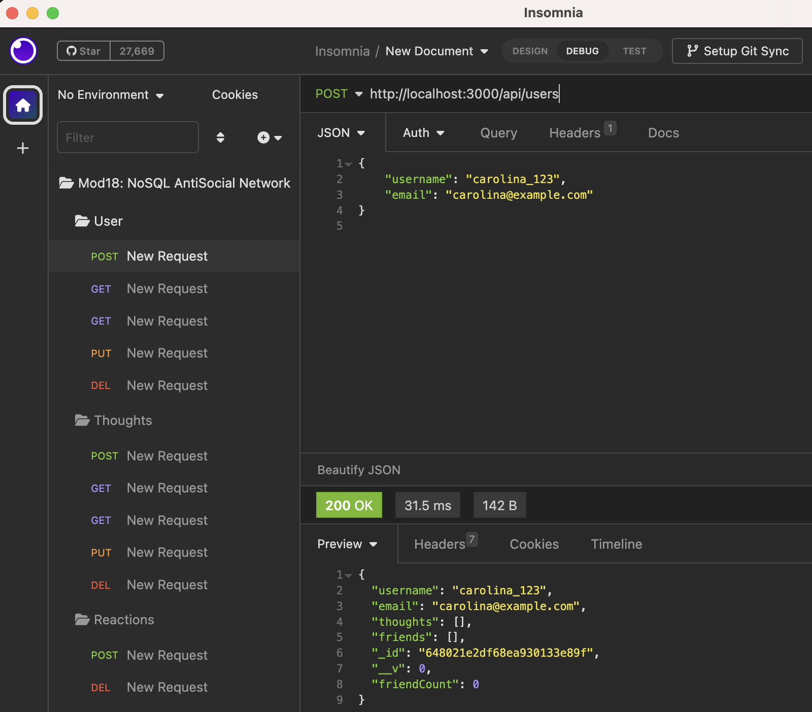

# NoSQL-antisocial-network

## [Description:](#description)

        This project is an API for a social network web application using Express.js and MongoDB with Mongoose ODM. Mongoose ODM (Object Data Modeling) provides a higher-level abstraction over MongoDB, and allows developers to define schemas for their data, perform validations, create models, and interact with the MongoDB database using a more structured and convenient approach. The API is designed to handle large amounts of unstructured data, making MongoDB an ideal choice for its speed and flexibility. By leveraging these technologies, it was possible to create a robust backend that allows users to share thoughts, react to friends' thoughts, and manage their friend list. 

        To meet the acceptance criteria, the application starts the server and syncs Mongoose models to the MongoDB database. It provides formatted JSON responses for GET routes to retrieve user and thought data. It also allows successful creation, updating, and deletion of users, thoughts, reactions, and friend relationships through API POST, PUT, and DELETE routes.

        The project's file structure follows best practices, with separate folders for configurations, controllers, models, and routes. The config folder handles the MongoDB connection, while the controllers folder contains the logic for handling request controllers. The models folder defines the Mongoose models for User and Thought, with the required schema settings. The routes folder defines the API routes for accessing and manipulating user and thought data.

        This project satisfies the technical acceptance criteria by using the Mongoose package to connect to MongoDB, implementing the User and Thought models with the specified schema settings, and including the Reaction subdocument schema in the Thought model. It also properly formats timestamps in the queried data.

        In summary, this NoSQL: Antisocial Network API project combines Express.js, MongoDB, and Mongoose to build a powerful API for a social network web application, providing essential features like thought sharing, reactions, and friend management.

## [Table of Contents:](#table-of-contents:)
   
- [Description](#description)
- [Installation](#installation)
- [Usage](#usage)
- [License](#license)
- [Contributing](#contributing)
- [Tests](#tests)
- [Questions](#questions)
   
## [Installation:](#installation:)

    Prior to using the NoSQL: AntiSocial Network API application, you should follow these steps:

    Clone the repository and install the required dependencies using the command npm install or npm i.

    The application relies on the following dependencies:

        Node.js: This JavaScript runtime environment executes JavaScript code outside of a web browser, allowing the application to run as a standalone server.

        MongoDB: A popular NoSQL database used by many social networks. MongoDB offers 
        speed and flexibility for handling large amounts of unstructured data.

        Mongoose: Mongoose is an Object Data Modeling (ODM) library for MongoDB, which provides a convenient and structured way to interact with the database. It simplifies tasks such as defining schemas, creating models, and performing database operations.

        Express.js: Express.js is a web framework that simplifies the process of building RESTful APIs. It provides a robust set of features for routing, handling requests, and creating endpoints.

        dotenv: This dependency is used to load environment variables from a .env file into the application's process.env. It ensures sensitive information like API keys and database passwords are securely stored and not exposed in the code.

    By installing these dependencies, you will have the necessary tools to run and interact with the NoSQL Challenge: Social Network API application.
 
## [Usage:](#usage:)

    To using the NoSQL: AntiSocial Network API application, you'll need to make sure you first cloned the repository to your local machine and installed the required dependencies by running npm install or npm i, then follow the steps below:
    
    * Start the server $ npm start

    * Use an application like Insomnia or Postman to test the API routes, which include:

        * GET routes for all categories, products and tags
        * GET routes for a single category, product, or tag by ID.
        * POST, PUT, and DELETE routes for categories, products, and tags.
    
    * When done testing you can stop the application by pressing CTRL + C in your terminal.

Example of testing a route in Insomnia:

[Video Walk-through: Testing Routes In Insomnia](https://drive.google.com/file/d/1OpiQ_ZYnzZYq_J4PBbyFfUdwX6WTeDwY/view)

Disclaimer: This video contains background music that is not my own. I do not own the rights to the music, and it is used for entertainment purposes only, to listen to more of their music click on the following
[label](https://open.spotify.com/artist/4eYVVrnphe4blxWuzahYQE).

    To access the Github Repository visit:
    https://github.com/CarolinaRaIs/NoSQL-antisocial-network

    To access the deployed site visit:
    https://carolinarais.github.io/NoSQL-antisocial-network/    

## [License:](#license:)

       This project is licensed under the MIT license.
   
## [Contributing:](#contributing:)

       Contributions are welcome and encouraged for this project. If you find any issues or have any suggestions for new features, please open an issue or submit a pull request. Before submitting a pull request, please ensure that your code adheres to the project's coding guidelines and has appropriate test coverage. Thank you for your interest in contributing to this project!  
   
## [Tests:](#tests:)

       I encourage contributors to thoroughly explore the code and test it to ensure its functionality. Any feedback or suggestions regarding the testing process are welcomed and appreciated.
   
## [Questions:](#questions:)

       If you have any questions about the repo you can open an issue.

**If more questions arise you can also contact CarolinaRaIs at determination28@gmail.com**
   
       
------------------------------------------------------------------------------------------------
   
This README was generated by [CarolinaRaIs](https://github.com/CarolinaRaIs)